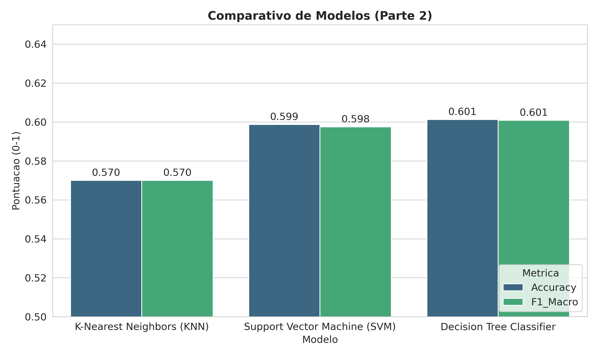
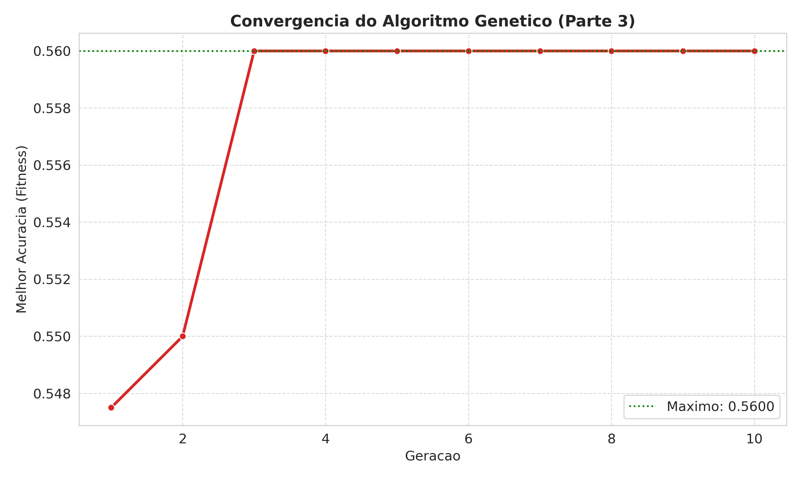
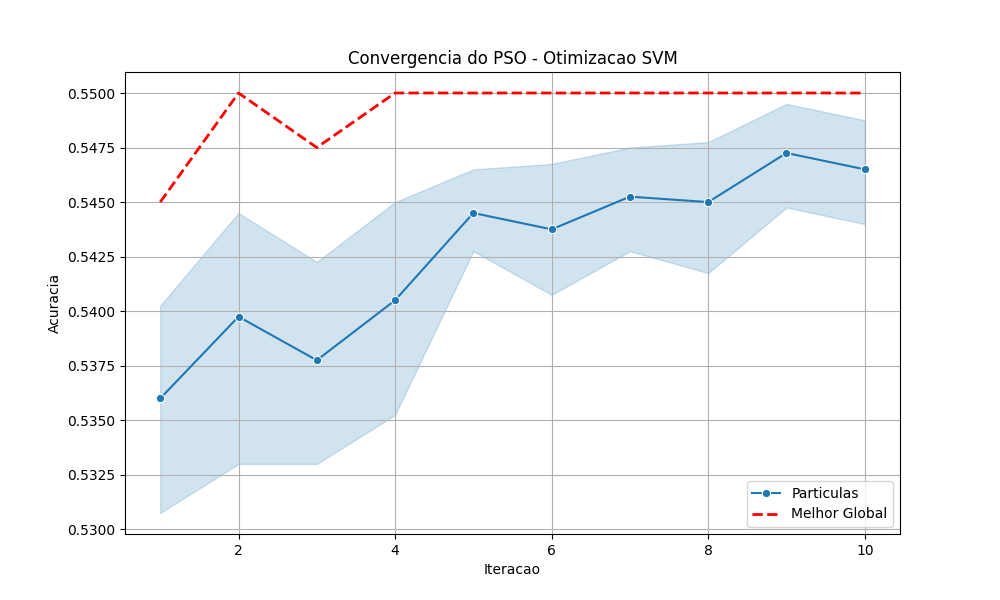
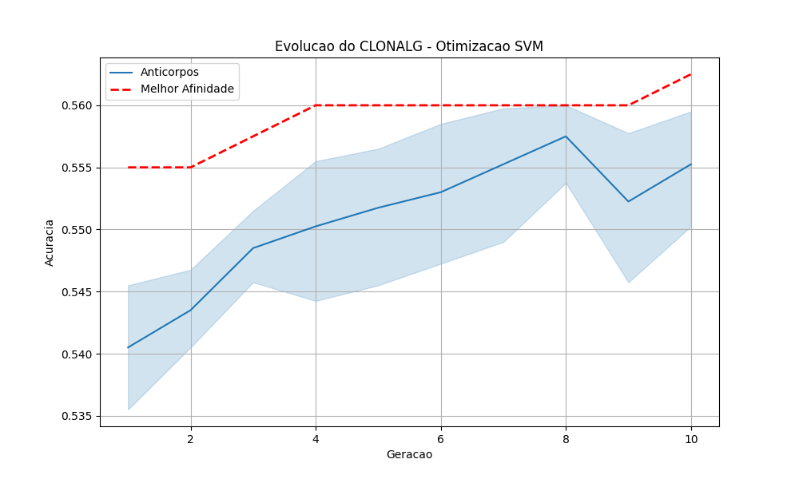

<p align="center"> 
  
</p>

<h1 align="center"> Trabalho Prático de Inteligência Artificial (2025/2) </h1>

Este repositório contém as implementações dos trabalhos práticos da disciplina de IA (CEFET-MG). O projeto está dividido em partes independentes, abordando árvores de decisão manuais, algoritmos de aprendizado de máquina supervisionado e técnicas de otimização bio-inspirada.

## Como Reproduzir

### Pré-requisitos
* Python 3.10 ou superior
* Gerenciador de pacotes `pip`
* `make` para automação (nativo no Linux/WSL)

### Instalação (via Makefile)
No terminal (Linux/WSL), execute:

```bash
make setup
```

-----

## Parte 1: Árvore de Decisão Manual

Implementação de uma árvore de decisão "hard-coded" (sem bibliotecas de ML) com tema livre.

  * **Tema:** Carreira em Programação.
  * **Objetivo:** 10 perguntas binárias que sugerem uma linguagem de programação ou stack baseada nas preferências do usuário.

### Execução

Para rodar a árvore interativa:

```bash
make part1
```

### Documentação

  * [Diagrama da Árvore (Mermaid)](src/part1_tree_manual/tree_diagram.md)

  

-----

## Parte 2: Aprendizado Supervisionado (Olist)

Aplicação e comparação de algoritmos de classificação (KNN, SVM, Árvore de Decisão) no dataset público de E-Commerce brasileiro (Olist).

  * **Problema:** Classificação Binária.
  * **Target:** Prever se um pedido será **entregue com atraso** (`is_late = 1`).
  * **Dataset:** [Olist Brazilian E-Commerce](https://www.kaggle.com/datasets/olistbr/brazilian-ecommerce).

### Estratégia de Dados

O dataset original apresenta um desbalanceamento severo (\~92% dos pedidos são entregues no prazo). Para permitir que os modelos aprendessem a identificar atrasos, foi utilizada a técnica de **Undersampling (Balanceamento)**:

  * Foram selecionados **todos** os casos de atraso disponíveis.
  * Foi selecionada uma amostra aleatória de casos "no prazo" de mesmo tamanho.
  * **Resultado:** Treinamento realizado com uma proporção de 50/50, maximizando o *Recall* da classe de atrasos.

### Execução

Siga a ordem abaixo para reproduzir os resultados:

```bash
make part2
# Executa preprocessamento + treinamento
```

### Resultados Obtidos

Os modelos apresentaram uma **Acurácia média de ~60%** após o balanceamento. Embora a acurácia global tenha diminuído em comparação ao modelo desbalanceado (que apenas "chutava" a classe majoritária), o **Recall (Revocação) para atrasos subiu significativamente**, tornando os modelos funcionalmente úteis para detectar problemas logísticos.



O gráfico acima compara o desempenho dos três algoritmos testados. Nota-se que o SVM e a Árvore de Decisão tiveram desempenho superior ao KNN, lidando melhor com a complexidade dos dados.

-----
## Parte 3: Algoritmo Genético (Otimização)

Implementação de um Algoritmo Genético (AG) **do zero** (sem bibliotecas de GA) para otimizar os hiperparâmetros do SVM da Parte 2.

### Definição do Problema

O objetivo é encontrar a melhor combinação de `C` e `Gamma` para maximizar a acurácia do SVM.

  * **Gene 1 (C):** Penalidade de erro (Busca no intervalo `[0.1, 100]`).
  * **Gene 2 (Gamma):** Coeficiente do Kernel RBF (Busca no intervalo `[0.0001, 1.0]`).

### Detalhes da Implementação

  * **Codificação:** Real-valued (Vetor de float).
  * **Fitness:** Acurácia do SVM treinado em uma amostra balanceada de 2.000 instâncias (para eficiência).
  * **Operadores Genéticos:**
      * **Seleção:** Torneio.
      * **Crossover:** Aritmético (Média ponderada).
      * **Mutação:** Gaussiana (Adição de ruído controlado).
      * **Elitismo:** Preservação dos 2 melhores indivíduos (Top-2).

### Execução

```bash
make part3
# ou: python src/part3_ga/run_tuning.py
```

### Análise dos Resultados

O algoritmo demonstrou convergência rápida (geralmente na 3ª geração) para:

  * **Gamma ≈ 0.0001** (Limite inferior).
  * **Acurácia ≈ 59-60%**.



O gráfico de evolução do fitness demonstra que o Algoritmo Genético convergiu rapidamente para o ótimo local, estagnando em seguida. Isso reforça a hipótese de que este é o limite preditivo intrínseco do dataset.

**Conclusão:** O AG "descobriu" que, devido ao ruído nos dados do Olist, a melhor estratégia é simplificar a fronteira de decisão (Gamma baixo -> modelo quase linear), evitando *overfitting*.

-----
## Parte 4: Computacao Bio-inspirada (Enxame e Sistemas Imunes)

Comparativo entre **Inteligencia de Enxame (PSO)** e **Sistemas Imunes Artificiais (CLONALG)** para a otimizacao dos mesmos hiperparametros do SVM da Parte 3, permitindo uma comparacao direta entre as tecnicas de otimizacao.

### Definicao do Problema
Otimizar os hiperparametros do SVM (mesmo problema da Parte 3) para comparar a eficiencia dos algoritmos:
* **C:** Penalidade de erro (Busca: `[0.1, 100]`).
* **Gamma:** Coeficiente do Kernel RBF (Busca: `[0.0001, 1.0]`).

### Algoritmos Implementados
1.  **PSO (Particle Swarm Optimization):** Otimizacao baseada no movimento de particulas que compartilham a melhor posicao global (*gBest*) e lembram sua melhor posicao individual (*pBest*).
2.  **CLONALG (Clonal Selection Algorithm):** Baseado na teoria da selecao clonal, utiliza taxas de mutacao inversamente proporcionais a afinidade (fitness) e insercao de anticorpos aleatorios para diversidade.

### Execucao

```bash
make part4
# ou individualmente:
# python src/part4_swarm_immune/pso_tunning.py
# python src/part4_swarm_immune/immune_tuning.py
```

### Resultados e Comparativo

Tabela comparativa das tecnicas de otimizacao aplicadas ao SVM:

| Algoritmo | C | Gamma | Acuracia (Validacao) | Acuracia (Teste) |
| --- | --- | --- | --- | --- |
| **AG (Parte 3)** | 63.98 | 0.0001 | 56.00% | - |
| **PSO** | 50.24 | 0.7882 | 55.00% | 55.42% |
| **CLONALG** | 55.52 | 0.0560 | 56.25% | **57.31%** |

### Analise dos Resultados

O CLONALG obteve o melhor desempenho entre as meta-heuristicas, encontrando um valor de Gamma intermediario que equilibra a complexidade do modelo. O PSO convergiu rapidamente mas ficou preso em um gamma alto, resultando em uma fronteira de decisao mais complexa.

**Comparativo das Tecnicas:**
* **AG:** Convergencia rapida para gamma baixo (~0.0001), modelo quase linear.
* **PSO:** Estabilizou com gamma alto (~0.79), modelo mais complexo.
* **CLONALG:** Encontrou gamma intermediario (~0.056), melhor generalizacao.

**Conclusao:** O mecanismo de hipermutacao do CLONALG permitiu maior exploracao do espaco de busca, evitando a convergencia prematura observada no PSO. A acuracia em torno de 55-57% confirma o limite preditivo do dataset com as features disponiveis.

### Graficos de Convergencia

<p align="center">


</p>

-----

## Estrutura do Projeto

```
ia-trabalho-2025-2/
├── data/
│   ├── raw/                 # Arquivos CSV originais (Olist)
│   └── processed/           # Dados processados (.npy) para treino
├── notebooks/
│   └── EDA.ipynb            # Análise exploratória dos dados
├── reports/
│   ├── figs/                # Figuras geradas para o relatório/README
│   ├── part2_ml/
│   │   ├── metrics.csv
│   │   └── metrics_details.txt
│   ├── part3_ga/
│   │   ├── generation_history.csv
│   │   └── tuning_results.csv
│   └── part4_swarm_immune/
│       ├── immune_history.csv
│       ├── immune_final_result.txt
│       ├── pso_history.csv
│       └── pso_final_result.txt
├── src/
│   ├── common/              # Utilitários e reprodutibilidade (Seeds)
│   ├── part1_tree_manual/
│   │   ├── tree_manual.py
│   │   └── tree_diagram.md
│   ├── part2_ml/
│   │   ├── preprocess.py
│   │   ├── train_knn.py
│   │   ├── train_svm.py
│   │   ├── train_tree.py
│   │   └── utils_metrics.py
│   ├── part3_ga/
│   │   ├── ga.py
│   │   └── run_tuning.py
│   └── part4_swarm_immune/
│       ├── pso_tunning.py
│       └── immune_tuning.py
├── tests/
│   ├── test_ga.py
│   ├── test_models.py
│   └── test_swarm.py
├── LICENSE
├── Makefile
├── requirements.txt
└── README.md
```

## Autores

  * **Rafael Adolfo Silva Ferreira (Radsfer)** - Engenharia de Computação (CEFET-MG)
