<p align="center"> 
  
</p>

<h1 align="center"> Trabalho Prático de Inteligência Artificial (2025/2) </h1>

Este repositório contém as implementações dos trabalhos práticos da disciplina de IA (CEFET-MG). O projeto está dividido em partes independentes, abordando árvores de decisão manuais e algoritmos de aprendizado de máquina supervisionado.

## 🚀 Como Reproduzir

### Pré-requisitos
* Python 3.10 ou superior
* Gerenciador de pacotes `pip`

### Instalação
1. Clone o repositório e navegue até a pasta raiz.
2. Crie e ative um ambiente virtual (recomendado):
```bash
   # Windows (PowerShell)
   python -m venv .venv
   .venv\Scripts\Activate.ps1
   
   # Linux/Mac
   python3 -m venv .venv
   source .venv/bin/activate
````

3.  Instale as dependências:
```bash
    pip install -r requirements.txt
 ```

-----

## 🌳 Parte 1: Árvore de Decisão Manual

Implementação de uma árvore de decisão "hard-coded" (sem bibliotecas de ML) com tema livre.

  * **Tema:** Carreira em Programação.
  * **Objetivo:** 10 perguntas binárias que sugerem uma linguagem de programação ou stack baseada nas preferências do usuário.

### Execução

Para rodar a árvore interativa:

```bash
python src/part1_tree_manual/tree_manual.py
```

### Documentação

  * [Diagrama da Árvore (Mermaid)](src/part1_tree_manual/tree_diagram.md)

  

-----

## 🤖 Parte 2: Aprendizado Supervisionado (Olist)

Aplicação e comparação de algoritmos de classificação (KNN, SVM, Árvore de Decisão) no dataset público de E-Commerce brasileiro (Olist).

  * **Problema:** Classificação Binária.
  * **Target:** Prever se um pedido será **entregue com atraso** (`is_late = 1`).
  * **Dataset:** [Olist Brazilian E-Commerce](https://www.kaggle.com/datasets/olistbr/brazilian-ecommerce).

### Estratégia de Dados

O dataset original apresenta um desbalanceamento severo (\~92% dos pedidos são entregues no prazo). Para permitir que os modelos aprendessem a identificar atrasos, foi utilizada a técnica de **Undersampling (Balanceamento)**:

  * Foram selecionados **todos** os casos de atraso disponíveis.
  * Foi selecionada uma amostra aleatória de casos "no prazo" de mesmo tamanho.
  * **Resultado:** Treinamento realizado com uma proporção de 50/50, maximizando o *Recall* da classe de atrasos.

### Execução

Siga a ordem abaixo para reproduzir os resultados:

1.  **Pré-processamento:**
    Gera os arquivos de treino e teste balanceados em `data/processed/`.

    ```bash
    python src/part2_ml/preprocess.py
    ```

2.  **Treinamento e Avaliação:**
    Cada script treina um modelo específico e salva as métricas em `reports/metrics.csv`.

    ```bash
    python src/part2_ml/train_knn.py
    python src/part2_ml/train_svm.py
    python src/part2_ml/train_tree.py
    ```

### Resultados Obtidos

Os modelos apresentaram uma **Acurácia média de \~60%** após o balanceamento. Embora a acurácia global tenha diminuído em comparação ao modelo desbalanceado (que apenas "chutava" a classe majoritária), o **Recall (Revocação) para atrasos subiu significativamente**, tornando os modelos funcionalmente úteis para detectar problemas logísticos.

-----

## 🛠️ Estrutura do Projeto

```
ia-trabalho-2025-2/
├── data/
│   ├── raw/            # Arquivos CSV originais (Olist)
│   └── processed/      # Dados processados (.npy) para treino
├── reports/
|   ├── figs # figuras geradas pro relatório/readme 
|   └── part2_ml
│     ├── metrics.csv     # Tabela comparativa de resultados
│     └── metrics_details.txt # Relatórios detalhados (Matriz de Confusão)
├── src/
│   ├── common/         # Utilitários de sistema e reprodutibilidade (Seeds)
│   ├── part1_tree_manual/
│   │   ├── tree_manual.py
│   │   └── tree_diagram.md
│   └── part2_ml/
│       ├── preprocess.py
│       ├── train_knn.py
│       ├── train_svm.py
│       ├── train_tree.py
│       └── utils_metrics.py
├── requirements.txt
└── README.md
```

## 👥 Autores

  * **Rafael (Radsfer)** - Engenharia de Computação (CEFET-MG)
