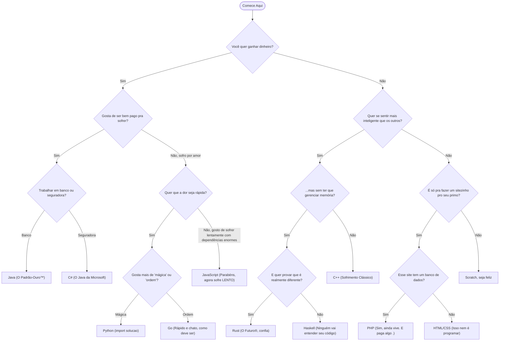

```mermaid
flowchart TD
    start(["Comece Aqui"]) --> q1{"Você quer ganhar dinheiro?"}

    q1 -->|Sim| q2{"Gosta de ser bem pago pra sofrer?"}
    q1 -->|Não| q6{"Quer se sentir mais inteligente que os outros?"}

    %% --- RAMO 1: O CAPITALISTA (SOFREDOR) ---
    q2 -->|Sim| q3{"Trabalhar em banco ou seguradora?"}
    q2 -->|Não, sofro por amor| q4{"Quer que a dor seja rápida?"}

    q3 -->|Banco| s1["Java (O Padrão-Ouro™)"]
    q3 -->|Seguradora| s2["C# (O Java da Microsoft)"]

    q4 -->|Sim| q5{"Gosta mais de 'mágica' ou 'ordem'?"}
    q4 -->|Não, gosto de sofrer lentamente com dependências enormes| s5["JavaScript (Parabéns, agora sofre LENTO)"]

    q5 -->|Mágica| s3["Python (import solucao)"]
    q5 -->|Ordem| s4["Go (Rápido e chato, como deve ser)"]

    %% --- RAMO 2: O ARTISTA (EGO) ---
    q6 -->|Sim| q7{"...mas sem ter que gerenciar memória?"}
    q6 -->|Não| q9{"É só pra fazer um sitezinho pro seu primo?"}

    q7 -->|Sim| q8{"E quer provar que é realmente diferente?"}
    q7 -->|Não| s8["C++ (Sofrimento Clássico)"]

    q8 -->|Sim| s7["Rust (O Futuro®, confia)"]
    q8 -->|Não| s6["Haskell (Ninguém vai entender seu código)"]
    
    q9 -->|Sim| q10{"Esse site tem um banco de dados?"}
    q9 -->|Não| s11["Scratch, seja feliz"]
    
    q10 -->|Sim| s9["PHP (Sim, ainda vive. E paga algo .)"]
    q10 -->|Não| s10["HTML/CSS (Isso nem é programar)"]
```

